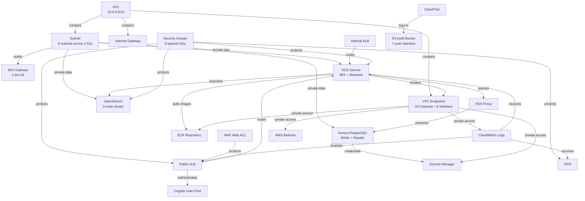

# Data Model: AWS CDK Infrastructure for Bedrock Agent Platform

**Feature**: `002-create-python-application`  
**Date**: 2025-10-07  
**Status**: Draft

## Overview
This document defines the infrastructure entities and their relationships as CDK constructs. Unlike application data models, infrastructure entities represent AWS resources managed as code with properties, relationships, and lifecycle rules enforced through CDK synthesis and CloudFormation.

## Entity Catalog

### Network Layer

#### 1. VPC (Virtual Private Cloud)
**AWS Resource**: `AWS::EC2::VPC`  
**CDK Construct**: `ec2.Vpc`

**Properties**:
- `cidr_block`: string (e.g., "10.0.0.0/16")
- `enable_dns_support`: boolean (true)
- `enable_dns_hostnames`: boolean (true)
- `max_azs`: integer (2 for us-east-1a, us-east-1b)

**Validation Rules**:
- CIDR block must be valid IPv4 range (RFC 1918 private addresses preferred)
- Must span at least 2 availability zones for multi-AZ requirement

**Relationships**:
- Contains: [Subnet] (1:many)
- Contains: [InternetGateway] (1:1)
- Contains: [VPCEndpoint] (1:many)

#### 2. Subnet
**AWS Resource**: `AWS::EC2::Subnet`  
**CDK Construct**: `ec2.Subnet`

**Properties**:
- `availability_zone`: string (us-east-1a | us-east-1b)
- `cidr_block`: string (e.g., "10.0.1.0/24")
- `subnet_type`: enum (PUBLIC | PRIVATE_APPLICATION | PRIVATE_AGENTCORE | PRIVATE_DATA)
- `map_public_ip_on_launch`: boolean (true for PUBLIC, false otherwise)

**Validation Rules**:
- CIDR must be subset of VPC CIDR
- Public subnets: 10.0.1.0/24 (AZ-1), 10.0.2.0/24 (AZ-2)
- Private application: 10.0.11.0/24 (AZ-1), 10.0.12.0/24 (AZ-2)
- Private AgentCore: 10.0.21.0/24 (AZ-1), 10.0.22.0/24 (AZ-2)
- Private data: 10.0.31.0/24 (AZ-1), 10.0.32.0/24 (AZ-2)

**Relationships**:
- BelongsTo: [VPC] (many:1)
- Contains: [NetworkInterface] (1:many)
- AssociatedWith: [RouteTable] (many:1)
- AssociatedWith: [NetworkACL] (many:1)

**State Transitions**:
- Creating → Available → Deleting → Deleted
- No in-place CIDR modification (requires recreation)

#### 3. InternetGateway
**AWS Resource**: `AWS::EC2::InternetGateway`  
**CDK Construct**: `ec2.CfnInternetGateway`

**Properties**:
- `vpc_id`: string (reference to VPC)

**Validation Rules**:
- Can only be attached to one VPC
- Required for public subnet internet access

**Relationships**:
- AttachedTo: [VPC] (1:1)
- UsedBy: [RouteTable] (1:many, via 0.0.0.0/0 route)

#### 4. NATGateway
**AWS Resource**: `AWS::EC2::NatGateway`  
**CDK Construct**: `ec2.CfnNatGateway`

**Properties**:
- `subnet_id`: string (must be public subnet)
- `allocation_id`: string (Elastic IP allocation)
- `connectivity_type`: enum (public | private) - default: public

**Validation Rules**:
- One NAT gateway per availability zone (for HA)
- Must reside in public subnet
- Requires Elastic IP for public connectivity

**Relationships**:
- DeployedIn: [Subnet] (many:1, public subnets only)
- UsedBy: [RouteTable] (1:many, private subnet default routes)
- Requires: [ElasticIP] (1:1)

#### 5. VPCEndpoint
**AWS Resource**: `AWS::EC2::VPCEndpoint`  
**CDK Construct**: `ec2.InterfaceVpcEndpoint` or `ec2.GatewayVpcEndpoint`

**Properties**:
- `service_name`: string (e.g., "com.amazonaws.us-east-1.bedrock-runtime")
- `vpc_endpoint_type`: enum (Interface | Gateway)
- `subnet_ids`: list[string] (private subnets for interface endpoints)
- `security_group_ids`: list[string] (for interface endpoints)
- `private_dns_enabled`: boolean (true for interface endpoints)

**Validation Rules**:
- Interface endpoints: Bedrock, Secrets Manager, SSM, ECR API, ECR Docker, CloudWatch Logs
- Gateway endpoints: S3 only (free, no hourly charge)
- Interface endpoints must be deployed in private subnets across both AZs

**Relationships**:
- BelongsTo: [VPC] (many:1)
- DeployedIn: [Subnet] (many:many for interface endpoints)
- ProtectedBy: [SecurityGroup] (many:many for interface endpoints)
- UsedBy: [ECSTask, LambdaFunction, RDSInstance] (many:many)

**State Transitions**:
- Pending → Available → Deleting → Deleted
- PendingAcceptance (for non-AWS services) → Available

### Security Layer

#### 6. SecurityGroup
**AWS Resource**: `AWS::EC2::SecurityGroup`  
**CDK Construct**: `ec2.SecurityGroup`

**Properties**:
- `group_name`: string
- `description`: string (required)
- `vpc_id`: string (reference to VPC)
- `ingress_rules`: list[SecurityGroupRule]
- `egress_rules`: list[SecurityGroupRule]

**Validation Rules**:
- Default deny all (no implicit allow rules)
- Least privilege: specific ports, protocols, sources only
- No 0.0.0.0/0 sources except public ALB security group (port 443 only)

**Relationships**:
- BelongsTo: [VPC] (many:1)
- ProtectsResources: [ALB, ECSTask, RDSInstance, OpenSearchDomain, VPCEndpoint] (many:many)
- References: [SecurityGroup] (self-referential for service mesh patterns)

**Layered Architecture**:
- `alb-public-sg`: Ingress 443 from 0.0.0.0/0 → Egress to `ecs-bff-sg`
- `alb-internal-sg`: Ingress 443 from `ecs-bff-sg` → Egress to `ecs-backend-sg`
- `ecs-bff-sg`: Ingress from `alb-public-sg` → Egress to `alb-internal-sg`, `vpc-endpoint-sg`
- `ecs-backend-sg`: Ingress from `alb-internal-sg` → Egress to `rds-proxy-sg`, `opensearch-sg`, `vpc-endpoint-sg`
- `rds-proxy-sg`: Ingress 5432 from `ecs-backend-sg` → Egress to `rds-sg`
- `rds-sg`: Ingress 5432 from `rds-proxy-sg` → No egress (database endpoint)
- `opensearch-sg`: Ingress 443 from `ecs-backend-sg` → No egress
- `vpc-endpoint-sg`: Ingress 443 from private subnet CIDR ranges → Egress to AWS service IPs

#### 7. NetworkACL
**AWS Resource**: `AWS::EC2::NetworkAcl`  
**CDK Construct**: `ec2.NetworkAcl`

**Properties**:
- `vpc_id`: string (reference to VPC)
- `entries`: list[NetworkAclEntry]

**Validation Rules**:
- Stateless rules (must allow return traffic explicitly)
- Rule numbers 1-32766 (lower numbers processed first)
- Explicit deny rules override allow rules

**Relationships**:
- BelongsTo: [VPC] (many:1)
- AssociatedWith: [Subnet] (many:many)

**Default Rules** (can be overridden):
- Public subnets: Allow all inbound/outbound (security group enforcement primary)
- Private subnets: Deny inbound from internet, allow outbound through NAT

#### 8. WAFWebACL
**AWS Resource**: `AWS::WAFv2::WebACL`  
**CDK Construct**: `wafv2.CfnWebACL`

**Properties**:
- `name`: string
- `scope`: enum (REGIONAL for ALB, CLOUDFRONT for CDN)
- `default_action`: enum (Allow | Block)
- `rules`: list[WAFRule]
- `managed_rule_group_statements`: list[ManagedRuleGroup]

**Validation Rules**:
- Must include AWS Managed Rules (AWSManagedRulesCommonRuleSet, AWSManagedRulesKnownBadInputsRuleSet)
- Rate limiting rule: 2000 requests per 5 minutes per IP
- Priority ordering: Rate limit (priority 1) → Managed rules (priority 2+)

**Relationships**:
- AssociatedWith: [ApplicationLoadBalancer] (1:1, public ALB only)

**Managed Rule Groups**:
- `AWSManagedRulesCommonRuleSet`: OWASP Top 10 protection (SQL injection, XSS, LFI)
- `AWSManagedRulesKnownBadInputsRuleSet`: Known CVE exploits, malicious patterns

### Compute Layer

#### 9. ApplicationLoadBalancer
**AWS Resource**: `AWS::ElasticLoadBalancingV2::LoadBalancer`  
**CDK Construct**: `elbv2.ApplicationLoadBalancer`

**Properties**:
- `name`: string
- `scheme`: enum (internet-facing | internal)
- `subnets`: list[string] (public subnets for internet-facing, private for internal)
- `security_groups`: list[string]
- `ip_address_type`: enum (ipv4 | dualstack)

**Validation Rules**:
- Public ALB: internet-facing, deployed in public subnets across both AZs
- Internal ALB: internal scheme, deployed in private application subnets across both AZs
- Must have at least 2 subnets in different AZs

**Relationships**:
- DeployedIn: [Subnet] (many:many, min 2 different AZs)
- ProtectedBy: [SecurityGroup] (many:many)
- ProtectedBy: [WAFWebACL] (1:1, public ALB only)
- Uses: [ACMCertificate] (many:1, HTTPS listeners)
- Routes: [TargetGroup] (1:many via listener rules)

**State Transitions**:
- Provisioning → Active → Active_impaired → Failed
- Deletion requires removing all listeners, target groups

#### 10. TargetGroup
**AWS Resource**: `AWS::ElasticLoadBalancingV2::TargetGroup`  
**CDK Construct**: `elbv2.ApplicationTargetGroup`

**Properties**:
- `target_type`: enum (instance | ip | lambda | alb)
- `protocol`: enum (HTTP | HTTPS)
- `port`: integer (e.g., 8080 for BFF, 4000 for GraphQL backend)
- `vpc_id`: string
- `health_check`: HealthCheckConfig
- `deregistration_delay`: integer (seconds, default 300)

**Health Check Configuration**:
- `path`: string (e.g., "/health", "/graphql?query={__typename}")
- `interval`: integer (30 seconds)
- `timeout`: integer (5 seconds)
- `healthy_threshold`: integer (2 consecutive successes)
- `unhealthy_threshold`: integer (3 consecutive failures)
- `matcher`: string (HTTP 200-299 or GraphQL-specific status)

**Validation Rules**:
- IP target type required for Fargate tasks
- Health check path must return 200 OK when service is healthy
- Deregistration delay allows in-flight requests to complete (connection draining)

**Relationships**:
- BelongsTo: [VPC] (many:1)
- RegistersTargets: [ECSTask, LambdaFunction] (many:many)
- UsedBy: [ApplicationLoadBalancer] (many:1)

#### 11. ECSCluster
**AWS Resource**: `AWS::ECS::Cluster`  
**CDK Construct**: `ecs.Cluster`

**Properties**:
- `cluster_name`: string
- `container_insights`: boolean (true for CloudWatch Container Insights)
- `capacity_providers`: list[string] (FARGATE, FARGATE_SPOT)

**Validation Rules**:
- Container Insights required for observability (CloudWatch metrics)
- Fargate capacity provider for serverless container execution

**Relationships**:
- DeployedIn: [VPC] (1:1)
- Contains: [ECSService] (1:many)

#### 12. ECSService
**AWS Resource**: `AWS::ECS::Service`  
**CDK Construct**: `ecs.FargateService`

**Properties**:
- `service_name`: string
- `cluster`: string (ECS cluster ARN)
- `task_definition`: string (task definition ARN)
- `desired_count`: integer (min 2 for HA)
- `deployment_configuration`: DeploymentConfig
- `network_configuration`: NetworkConfiguration
- `load_balancers`: list[LoadBalancerConfig]

**Deployment Configuration**:
- `maximum_percent`: integer (200 for rolling deployments)
- `minimum_healthy_percent`: integer (100 for zero-downtime)
- `deployment_circuit_breaker`: boolean (true, auto-rollback on failure)

**Network Configuration**:
- `subnets`: list[string] (private application or AgentCore subnets)
- `security_groups`: list[string]
- `assign_public_ip`: boolean (false, private subnets)

**Validation Rules**:
- Desired count ≥ 2 for production (multi-AZ HA)
- Tasks distributed across both AZs via subnet selection
- Circuit breaker enables automatic rollback on health check failures

**Relationships**:
- BelongsTo: [ECSCluster] (many:1)
- RunsTaskDefinition: [ECSTaskDefinition] (many:1)
- DeployedIn: [Subnet] (many:many, private subnets)
- ProtectedBy: [SecurityGroup] (many:many)
- RegistersWith: [TargetGroup] (many:many)

**State Transitions**:
- ACTIVE (running) ↔ DRAINING (deregistering tasks) → INACTIVE (deleted)

### Database Layer

#### 13. AuroraCluster
**AWS Resource**: `AWS::RDS::DBCluster`  
**CDK Construct**: `rds.DatabaseCluster`

**Properties**:
- `engine`: enum (aurora-postgresql)
- `engine_version`: string (15.4)
- `engine_mode`: enum (provisioned)
- `database_name`: string (e.g., "bedrock_agents")
- `master_username`: string (e.g., "postgres")
- `storage_encrypted`: boolean (true, mandatory)
- `kms_key_id`: string (AWS managed KMS key for PoC)
- `backup_retention_period`: integer (days, 7 for PoC, 30 for prod)
- `preferred_backup_window`: string (e.g., "03:00-04:00")
- `preferred_maintenance_window`: string (e.g., "sun:04:00-sun:05:00")
- `enable_http_endpoint`: boolean (false, not needed for this use case)
- `backtrack_window`: integer (seconds, 86400 for 24-hour point-in-time recovery)

**Cluster Writer/Reader Instances**:
- Writer instance: `db.t4g.medium` (dev), `db.r6g.xlarge` (prod) in us-east-1a
- Reader instance: `db.t4g.medium` (dev), `db.r6g.xlarge` (prod) in us-east-1b
- Auto-scaling read replicas: 1-15 replicas based on CPU/connections

**Validation Rules**:
- Minimum 1 writer + 1 reader for HA (automatic failover to reader)
- Storage encryption mandatory (constitution: encryption at rest)
- Master credentials stored in Secrets Manager (no hardcoded passwords)
- Backup retention ≥ 7 days (RPO <1min via Aurora continuous backups)
- Backtrack enabled for instant point-in-time recovery (no restore required)

**Relationships**:
- DeployedIn: [Subnet] (many:many, private data subnets via DB subnet group)
- ProtectedBy: [SecurityGroup] (many:1, `aurora-sg`)
- AccessedVia: [RDSProxy] (1:many)
- StoresCredentialsIn: [Secret] (1:1)
- Contains: [AuroraInstance] (1:many, writer + readers)

**State Transitions**:
- Creating → Available → Modifying → Available
- Available → Backing-up → Available (automated continuous backups)
- Available → Failing-over → Available (Aurora failover, 30-60 seconds)
- Available → Backtracking → Available (instant PITR, no downtime)

**Failover Behavior**:
- Writer in us-east-1a → Reader promoted to writer in us-east-1b (automatic)
- Storage-level replication: 6 copies across 3 AZs (survives loss of 1 entire AZ)
- Automatic failover triggers: AZ failure, writer instance failure, storage failure
- RDS Proxy maintains connection pool during failover (application-transparent)
- Failover priority: tier-0 (highest) for designated reader replica

#### 13a. AuroraInstance
**AWS Resource**: `AWS::RDS::DBInstance` (part of Aurora cluster)  
**CDK Construct**: `rds.ClusterInstance`

**Properties**:
- `cluster_identifier`: string (foreign key to Aurora cluster)
- `instance_class`: string (e.g., db.t4g.medium for dev, db.r6g.xlarge for prod)
- `availability_zone`: string (us-east-1a for writer, us-east-1b for reader)
- `promotion_tier`: integer (0 for primary reader, 1+ for secondary readers)
- `publicly_accessible`: boolean (false, private subnet only)

**Validation Rules**:
- Writer and reader instances must be in different AZs
- All instances use same instance class for predictable failover performance
- Promotion tier determines failover order (tier-0 promoted first)

**Relationships**:
- BelongsTo: [AuroraCluster] (many:1)
- DeployedIn: [Subnet] (1:1, private data subnet in specific AZ)

#### 14. RDSProxy
**AWS Resource**: `AWS::RDS::DBProxy`  
**CDK Construct**: `rds.DatabaseProxy`

**Properties**:
- `db_proxy_name`: string
- `engine_family`: enum (POSTGRESQL)
- `auth`: list[AuthConfig] (Secrets Manager secret ARN)
- `require_tls`: boolean (true)
- `vpc_subnet_ids`: list[string] (private data subnets)
- `vpc_security_group_ids`: list[string]
- `idle_client_timeout`: integer (seconds, 1800 default)

**Validation Rules**:
- Deployed in same subnets as Aurora cluster (private data subnets)
- TLS required for client connections (constitution: encryption in transit)
- Auth config references Secrets Manager secret (no hardcoded credentials)

**Relationships**:
- ProxiesFor: [AuroraCluster] (1:1, connects to cluster endpoint)
- DeployedIn: [Subnet] (many:many, private data subnets)
- ProtectedBy: [SecurityGroup] (many:1, `rds-proxy-sg`)
- AuthenticatesUsing: [Secret] (1:1)
- AccessedBy: [ECSService] (many:many via security group)

**Connection Pooling**:
- Max connections per proxy endpoint: based on Aurora cluster `max_connections` parameter
- Connection multiplexing: reduces Aurora connections for bursty Lambda/Fargate workloads
- Failover handling: transparent reconnection to promoted reader (no application retry logic)
- Read/write splitting: proxy routes to cluster writer endpoint (automatic after failover)

#### 15. OpenSearchDomain
**AWS Resource**: `AWS::OpenSearchService::Domain`  
**CDK Construct**: `opensearch.Domain`

**Properties**:
- `domain_name`: string
- `version`: string (OpenSearch 2.11)
- `cluster_config`: ClusterConfig
- `ebs_options`: EBSOptions
- `encryption_at_rest`: EncryptionAtRestOptions (enabled, AWS managed KMS)
- `node_to_node_encryption`: boolean (true)
- `vpc_options`: VPCOptions

**Cluster Configuration**:
- `instance_type`: string (t3.small.search for dev, r6g.large.search for prod)
- `instance_count`: integer (2 for dev, 3 for prod)
- `zone_awareness_enabled`: boolean (true)
- `zone_awareness_config`: { availability_zone_count: 2 }
- `dedicated_master_enabled`: boolean (true for prod, false for dev)
- `dedicated_master_type`: string (t3.small.search)
- `dedicated_master_count`: integer (3 for quorum)

**EBS Options**:
- `volume_type`: enum (gp3)
- `volume_size`: integer (100 GB for dev, 500 GB for prod)
- `iops`: integer (3000 for gp3 baseline)
- `throughput`: integer (125 MB/s for gp3 baseline)

**Validation Rules**:
- VPC deployment required (no public endpoint)
- Node-to-node encryption mandatory (TLS 1.2+)
- Encryption at rest mandatory (AWS managed KMS for PoC)
- Zone awareness required for multi-AZ HA (3-node minimum for production quorum)

**Relationships**:
- DeployedIn: [Subnet] (many:many, private data subnets)
- ProtectedBy: [SecurityGroup] (many:1, `opensearch-sg`)
- AccessedBy: [ECSService] (many:many via security group)

**State Transitions**:
- Creating → Active → Modifying → Active
- Active → Processing (rolling upgrades, configuration changes)

### Storage Layer

#### 16. S3Bucket
**AWS Resource**: `AWS::S3::Bucket`  
**CDK Construct**: `s3.Bucket`

**Properties**:
- `bucket_name`: string (globally unique)
- `versioning`: boolean (true for data buckets)
- `encryption`: ServerSideEncryptionConfiguration (AWS managed KMS)
- `public_access_block`: PublicAccessBlockConfiguration (block all public access)
- `lifecycle_rules`: list[LifecycleRule]

**Encryption Configuration**:
- `sse_algorithm`: enum (aws:kms)
- `kms_master_key_id`: string (AWS managed key for PoC)

**Public Access Block** (all enabled):
- `block_public_acls`: true
- `block_public_policy`: true
- `ignore_public_acls`: true
- `restrict_public_buckets`: true

**Validation Rules**:
- Versioning required for data durability (accidental deletion recovery)
- Encryption at rest mandatory (AWS managed KMS)
- Public access blocked by default (constitution: security first)
- Accessed via S3 VPC endpoint (no internet gateway traffic)

**Relationships**:
- AccessedVia: [VPCEndpoint] (many:1, S3 gateway endpoint)
- ManagedBy: [LifecyclePolicy] (1:many)
- AccessControlledBy: [IAMRole] (many:many via bucket policy)

**Lifecycle Rules**:
- Transition to Intelligent-Tiering after 30 days (cost optimization)
- Expire non-current versions after 90 days (versioned buckets)
- Delete incomplete multipart uploads after 7 days

#### 17. ECRRepository
**AWS Resource**: `AWS::ECR::Repository`  
**CDK Construct**: `ecr.Repository`

**Properties**:
- `repository_name`: string
- `image_scanning_configuration`: ImageScanningConfiguration (scan on push)
- `image_tag_mutability`: enum (IMMUTABLE)
- `encryption_configuration`: EncryptionConfiguration (AES256 default or KMS)
- `lifecycle_policy`: LifecyclePolicy

**Image Scanning Configuration**:
- `scan_on_push`: boolean (true, vulnerability scanning)

**Validation Rules**:
- Image tag immutability required (prevents tag overwrite, ensures reproducibility)
- Scan on push enabled (security: vulnerability detection before deployment)
- Lifecycle policy: retain last 10 images, delete untagged after 7 days

**Relationships**:
- AccessedVia: [VPCEndpoint] (many:many, ECR API + ECR Docker endpoints)
- PullsFrom: [ECSTaskDefinition] (1:many)

**Lifecycle Policy**:
```json
{
  "rules": [
    {
      "rulePriority": 1,
      "description": "Keep last 10 images",
      "selection": {
        "tagStatus": "any",
        "countType": "imageCountMoreThan",
        "countNumber": 10
      },
      "action": { "type": "expire" }
    },
    {
      "rulePriority": 2,
      "description": "Delete untagged images after 7 days",
      "selection": {
        "tagStatus": "untagged",
        "countType": "sinceImagePushed",
        "countUnit": "days",
        "countNumber": 7
      },
      "action": { "type": "expire" }
    }
  ]
}
```

### Secrets & Configuration Layer

#### 18. Secret
**AWS Resource**: `AWS::SecretsManager::Secret`  
**CDK Construct**: `secretsmanager.Secret`

**Properties**:
- `secret_name`: string (e.g., "bedrock-agent/aurora-master-password")
- `description`: string
- `generate_secret_string`: GenerateSecretStringConfig
- `replica_regions`: list[RegionConfig] (for multi-region DR)

**Generate Secret String Config** (for Aurora passwords):
- `secret_string_template`: JSON ({"username": "postgres"})
- `generate_string_key`: string ("password")
- `password_length`: integer (32)
- `exclude_characters`: string ("/@\" '\\")
- `require_each_included_type`: boolean (true, includes uppercase, lowercase, digits, symbols)

**Validation Rules**:
- Aurora master password auto-generated (no hardcoded values)
- Rotation enabled (90 days for production)
- Accessed via Secrets Manager VPC endpoint (private subnet access)

**Relationships**:
- AccessedVia: [VPCEndpoint] (many:1, Secrets Manager interface endpoint)
- UsedBy: [AuroraCluster, RDSProxy] (1:many)
- RotatedBy: [LambdaFunction] (1:1, auto-generated by Aurora integration)

**Rotation Configuration** (automatic for Aurora):
- Schedule: 90 days (cdk.Duration.days(90))
- Rotation function: auto-created Lambda with VPC access
- Rotation strategy: Single user (master password rotation)

#### 19. SSMParameter
**AWS Resource**: `AWS::SSM::Parameter`  
**CDK Construct**: `ssm.StringParameter`

**Properties**:
- `parameter_name`: string (e.g., "/bedrock-agent/vpc-cidr")
- `parameter_type`: enum (String | StringList | SecureString)
- `value`: string
- `tier`: enum (Standard | Advanced)
- `data_type`: string (text | aws:ec2:image)

**Validation Rules**:
- SecureString type for sensitive config (encrypted with AWS managed KMS key)
- Standard tier sufficient for PoC (4KB value limit, no parameter policies)
- Parameter Store for environment config (non-secret values: region, CIDR, instance sizes)

**Relationships**:
- AccessedVia: [VPCEndpoint] (many:1, SSM interface endpoint)
- ReferencedBy: [CDKStack] (many:many via `ssm.StringParameter.valueFromLookup()`)

**Usage Pattern**:
```python
# Store environment-specific config
vpc_cidr = ssm.StringParameter(
    self, "VpcCidr",
    parameter_name=f"/bedrock-agent/{env_name}/vpc-cidr",
    string_value="10.0.0.0/16"
)

# Reference in other stacks
cidr_value = ssm.StringParameter.value_from_lookup(
    self, f"/bedrock-agent/{env_name}/vpc-cidr"
)
```

### Monitoring Layer

#### 20. CloudWatchLogGroup
**AWS Resource**: `AWS::Logs::LogGroup`  
**CDK Construct**: `logs.LogGroup`

**Properties**:
- `log_group_name`: string (e.g., "/aws/ecs/bedrock-agent-bff")
- `retention_in_days`: integer (30 for dev, 90 for prod)
- `kms_key_id`: string (optional, AWS managed KMS for sensitive logs)

**Validation Rules**:
- Retention period defined (prevent indefinite storage costs)
- Accessed via CloudWatch Logs VPC endpoint (private subnet logging)
- JSON structured logging for queryability (CloudWatch Insights)

**Relationships**:
- AccessedVia: [VPCEndpoint] (many:1, CloudWatch Logs interface endpoint)
- ReceivesLogsFrom: [ECSTask, LambdaFunction, RDSInstance, ALB] (1:many)

**Log Subscription Patterns** (deferred to post-PoC):
- CloudWatch Logs → Kinesis Data Firehose → S3 (log archival)
- CloudWatch Logs → Lambda → OpenSearch (log analytics)

#### 21. CloudTrail
**AWS Resource**: `AWS::CloudTrail::Trail`  
**CDK Construct**: `cloudtrail.Trail`

**Properties**:
- `trail_name`: string
- `s3_bucket_name`: string (encrypted S3 bucket for trail logs)
- `include_global_service_events`: boolean (true, captures IAM, STS events)
- `is_multi_region_trail`: boolean (false for single-region PoC, true for prod)
- `management_events`: enum (ReadOnly | WriteOnly | All) - default: All
- `event_selectors`: list[EventSelector] (S3 data events, Lambda invocations)

**Validation Rules**:
- Trail logs stored in encrypted S3 bucket (7-year retention per spec clarification)
- Management events enabled (captures all API calls for audit)
- Log file validation enabled (integrity protection via SHA-256 digest)

**Relationships**:
- LogsTo: [S3Bucket] (1:1, dedicated audit bucket)
- Monitors: [VPC, RDSInstance, S3Bucket, etc.] (1:many, all AWS resources)

**Retention Strategy**:
- S3 bucket lifecycle: Move to Glacier after 90 days (cost optimization)
- Delete after 2555 days (7 years per compliance requirement)
- CloudWatch Logs integration: 30-day retention for real-time monitoring

### Authentication & Authorization Layer

#### 22. CognitoUserPool
**AWS Resource**: `AWS::Cognito::UserPool`  
**CDK Construct**: `cognito.UserPool`

**Properties**:
- `user_pool_name`: string (e.g., "bedrock-agents-users")
- `pool_id`: string (auto-generated, format: us-east-1_xxxxxxxxx)
- `pool_arn`: string (auto-generated ARN)
- `password_policy`: PasswordPolicy
  - `min_length`: integer (12)
  - `require_uppercase`: boolean (true)
  - `require_lowercase`: boolean (true)
  - `require_digits`: boolean (true)
  - `require_symbols`: boolean (true)
- `mfa_configuration`: enum (OFF | OPTIONAL | ON) - default: OPTIONAL
- `account_recovery`: enum (EMAIL_ONLY | PHONE_ONLY | EMAIL_AND_PHONE) - default: EMAIL_ONLY
- `auto_verified_attributes`: list[email, phone_number] - default: [email]
- `user_pool_domain`: string (custom domain or Cognito prefix)

**Validation Rules**:
- Password policy enforces minimum 12 characters with complexity requirements
- MFA optional for PoC, mandatory for production (principle: progressive security)
- Email verification required for account recovery
- User pool domain required for ALB authentication integration

**Relationships**:
- IntegratesWith: [ApplicationLoadBalancer] (1:1, ALB listener authenticate action)
- StoresIdentitiesFor: [EndUsers] (1:many, user directory)
- ExportsTo: [SSMParameter] (1:many, pool ID, client ID, domain for app config)

**State Transitions**:
```
[Provision] → CREATING → ACTIVE
ACTIVE → [Update password policy] → ACTIVE (hot config update)
ACTIVE → [Delete] → DELETING → DELETED
```

#### 23. CognitoUserPoolClient
**AWS Resource**: `AWS::Cognito::UserPoolClient`  
**CDK Construct**: `cognito.UserPoolClient`

**Properties**:
- `client_id`: string (auto-generated)
- `client_name`: string (e.g., "ALBClient")
- `user_pool_id`: string (foreign key to UserPool)
- `oauth_flows`: OAuthFlows
  - `authorization_code_grant`: boolean (true for ALB integration)
  - `implicit_grant`: boolean (false, security best practice)
  - `client_credentials`: boolean (false, not needed for user auth)
- `oauth_scopes`: list[OAuthScope] (openid, email, profile)
- `callback_urls`: list[string] (ALB DNS + /oauth2/idpresponse)
- `supported_identity_providers`: list[string] (["COGNITO"], expandable to Google, Facebook, SAML)
- `generate_secret`: boolean (false for public clients like ALB)

**Validation Rules**:
- Authorization code flow only (no implicit grant for security)
- Callback URLs must match ALB DNS or custom domain
- No client secret for ALB integration (public client pattern)
- OpenID scope mandatory for ID token generation

**Relationships**:
- BelongsTo: [CognitoUserPool] (many:1)
- UsedBy: [ApplicationLoadBalancer] (1:1, listener authenticate-cognito action)

**Usage Pattern**:
```python
# Security stack creates User Pool and Client
user_pool = cognito.UserPool(
    self, "UserPool",
    user_pool_name="bedrock-agents-users",
    password_policy=cognito.PasswordPolicy(
        min_length=12,
        require_uppercase=True,
        require_lowercase=True,
        require_digits=True,
        require_symbols=True
    ),
    mfa=cognito.Mfa.OPTIONAL
)

user_pool_client = user_pool.add_client(
    "ALBClient",
    o_auth=cognito.OAuthSettings(
        flows=cognito.OAuthFlows(authorization_code_grant=True),
        scopes=[cognito.OAuthScope.OPENID, cognito.OAuthScope.EMAIL, cognito.OAuthScope.PROFILE],
        callback_urls=[f"https://{alb_dns}/oauth2/idpresponse"]
    )
)

# Export for Compute stack
CfnOutput(self, "CognitoUserPoolId", value=user_pool.user_pool_id, export_name="CognitoUserPoolId")
CfnOutput(self, "CognitoClientId", value=user_pool_client.user_pool_client_id, export_name="CognitoClientId")
```

## Entity Relationship Diagram



## Stack Output Contracts

Each CDK stack exports specific outputs for cross-stack references:

### NetworkStack Outputs
- `VpcId`: VPC resource ID
- `PublicSubnetIds`: List of public subnet IDs (AZ-1, AZ-2)
- `PrivateAppSubnetIds`: List of private application subnet IDs
- `PrivateAgentCoreSubnetIds`: List of private AgentCore subnet IDs
- `PrivateDataSubnetIds`: List of private data subnet IDs
- `S3VpcEndpointId`: S3 gateway endpoint ID
- `BedrockVpcEndpointDnsName`: Bedrock interface endpoint DNS name

### SecurityStack Outputs
- `AlbPublicSgId`: Public ALB security group ID
- `AlbInternalSgId`: Internal ALB security group ID
- `EcsBffSgId`: ECS BFF service security group ID
- `EcsBackendSgId`: ECS backend service security group ID
- `RdsProxySgId`: RDS Proxy security group ID
- `RdsSgId`: RDS database security group ID
- `OpenSearchSgId`: OpenSearch security group ID
- `VpcEndpointSgId`: VPC endpoints security group ID
- `WafWebAclArn`: WAF Web ACL ARN

### DatabaseStack Outputs
- `RdsProxyEndpoint`: RDS Proxy connection endpoint
- `AuroraClusterEndpoint`: Aurora cluster writer endpoint (for admin access)
- `AuroraClusterReadEndpoint`: Aurora cluster reader endpoint (for read queries)
- `OpenSearchDomainEndpoint`: OpenSearch HTTPS endpoint
- `RdsMasterSecretArn`: Secrets Manager secret ARN for Aurora credentials

### StorageStack Outputs
- `DataBucketName`: S3 data bucket name
- `AuditBucketName`: S3 audit bucket name (CloudTrail)
- `EcrRepositoryUri`: ECR repository URI for container images

### MonitoringStack Outputs
- `EcsLogGroupName`: CloudWatch log group for ECS tasks
- `AlbLogGroupName`: CloudWatch log group for ALB access logs
- `CloudTrailArn`: CloudTrail trail ARN

---

**Data Model Complete** - Ready for contract generation and quickstart scenarios
